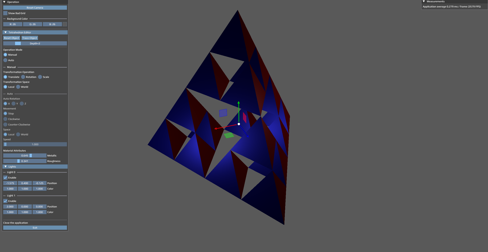

# Vulkan Tetrahedron

An interactive Vulkan demo that renders a fractal tetrahedron with GLFW, GLM, Dear ImGui, ImGuizmo, stb, and Vulkan Memory Allocator. The application includes an arcball camera, realtime material and lighting controls, shader compilation, and a small GNU Make build setup powered by TacoMake.

## Screenshot



## Features

- Renders a recursively generated tetrahedron in Vulkan.
- Supports depth changes for the fractal tetrahedron mesh.
- Provides an ImGui control panel for object transforms, auto-rotation, material attributes, lights, background color, and FPS display.
- Uses ImGuizmo for direct transform manipulation.
- Compiles GLSL shaders to SPIR-V during the build.
- Copies runtime assets into the build directory when running through `make run`.

## Requirements

- Windows with GNU Make available on `PATH`.
- A C++20-capable `g++`.
- A Vulkan-capable GPU and graphics driver.
- Vulkan runtime support.

The repository vendors the headers, libraries, shader compiler, fonts, textures, and TacoMake files that the current build expects:

- Vulkan headers and `vulkan-1.lib`
- GLFW library and headers
- GLM
- Dear ImGui and ImGuizmo sources
- stb headers
- VMA header
- `tools/glslc.exe`
- TacoMake build files in `tacomake/`

## Build

From the repository root:

```sh
make
```

This creates the executable at:

```text
build/school_vulkan.exe
```

During the build, shader files from `src/shaders` are compiled into:

```text
build/shaders/*.spv
```

## Run

```sh
make run
```

`make run` builds the project, copies files from `assets` into `build`, then launches the executable from inside the build directory. Running from `build` matters because the application loads shaders, textures, and fonts by relative paths.

## Clean

Remove generated object files, dependency files, and the executable:

```sh
make clean
```

Remove the full generated output directories:

```sh
make clean-all
```

## Controls

- Left mouse drag: orbit the camera.
- Shift + left mouse drag: pan the camera target.
- Mouse wheel: zoom.
- `Q`: close the application.
- ImGui `Operation` panel: reset camera, edit tetrahedron depth, switch transform modes, enable auto-rotation, edit material values, and configure lights.
- ImGuizmo overlay: translate, rotate, or scale the tetrahedron in manual mode.

## Project Layout

```text
assets/        Runtime textures and fonts.
include/       Vendored third-party headers.
lib/           Vendored libraries used by the linker.
src/           Application source and GLSL shaders.
tacomake/      Vendored TacoMake build files.
tools/         Local shader compiler tools.
Makefile       Project build configuration and Vulkan shader build rules.
```

## TacoMake

TacoMake is vendored directly in `tacomake/`. It has been updated from [Doner357/TacoMake](https://github.com/Doner357/TacoMake) at upstream commit `41d91c8`.

The upstream TacoMake files are kept as the generic C/C++ build layer. The Vulkan-specific SPIR-V shader rules live in this project's `Makefile`, so TacoMake can stay aligned with upstream while the application still builds its shaders automatically.
